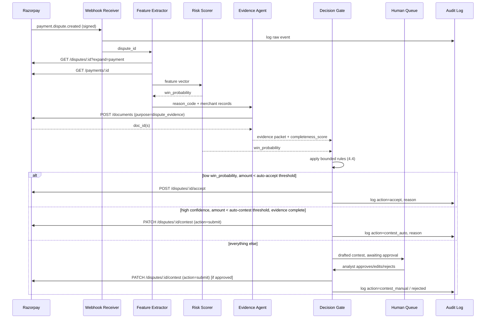

# DisputeGuard — AI Chargeback Evidence Responder
**Track 02: AI Risk Manager — Razorpay Hackathon**
**Author:** Aamod | **Status:** Draft v1 | **Class of loss addressed:** Disputes / Chargebacks

---

## 0. One-line pitch

DisputeGuard watches every payment dispute raised against a merchant's Razorpay account, scores the odds of winning it, auto-assembles the right evidence packet, and either contests or accepts the dispute within a bounded, human-gated workflow — with a full audit trail and measured precision/recall on a held-out set, exactly as the track bar demands.

---

## 1. PRD

### 1.1 Problem statement
Chargebacks are slow, manual, and deadline-driven. A merchant has a fixed `respond_by` window per dispute; missing it is an automatic loss. Most small/mid merchants either accept every dispute (losing money they could have won) or contest everything with weak, generic evidence (losing anyway, plus wasted ops time). Neither failure mode is visible until the money is already gone.

### 1.2 Goals
- Detect a dispute the moment it's raised (`payment.dispute.created` webhook) and classify it before a human even opens the dashboard.
- Predict win-probability for contesting, using a model with honestly reported precision/recall and false-positive cost — not a vibes-based rule.
- Auto-assemble the evidence packet Razorpay's Disputes + Documents API actually expects, mapped to the dispute's reason code.
- Take a bounded action (accept fast / draft-and-hold for approval / auto-contest under a strict threshold) — never a silent, unbounded money move.
- Produce an audit trail for every dispute: what was detected, what was predicted, what evidence was used, what action was taken, and why.

### 1.3 Non-goals
- Not a fraud-prevention/transaction-blocking tool (that's a different loss class — see Track 02's "Fraud-spike detector" direction, out of scope here).
- Not building a general customer-support bot; only the dispute-resolution surface.
- Not attempting to influence or deceive the issuing bank — evidence submitted is only ever what the merchant's own order/shipment/communication records actually support. No fabricated evidence, ever. This is the hard line that keeps this defense-only.

### 1.4 Users
- **Ops/finance analyst at the merchant** — reviews the queue, approves high-value or low-confidence contests, sees a running win-rate dashboard.
- **Merchant business owner** — cares about net money recovered and doesn't want to think about dispute mechanics.
- **Hackathon judge / evaluator** — needs to see the audit trail, the held-out metrics, and one failure handled gracefully, live.

### 1.5 Success metrics
| Metric | Definition | Target for demo |
|---|---|---|
| Win-rate lift | (win rate of DisputeGuard-contested disputes) vs (baseline accept-everything / contest-everything) | Report both, show lift |
| Precision / Recall | On held-out synthetic-labeled dispute set, for the "will win if contested" classifier | Report both + confusion matrix |
| False-positive cost | ₹ lost from auto-accepting disputes the model wrongly thought unwinnable | Report in ₹, not just %  |
| Time-to-response | Minutes from `payment.dispute.created` to evidence draft ready | < 5 min simulated |
| SLA safety | % of disputes responded to before `respond_by` deadline | 100% in demo batch |
| Auditability | % of actions with a complete, replayable audit record | 100% (non-negotiable) |

### 1.6 Constraints / honest assumptions
- Razorpay's **test mode does not organically generate real bank disputes** — disputes arise from an actual issuing bank chargeback flow that test mode doesn't simulate. So the demo uses two parallel, clearly-labeled tracks:
  1. **Real API integration** — coded against the live Disputes, Documents, and Payments API contracts (fetch, accept, contest, document upload), using a test-mode key so every call is real and inspectable, just triggered by a **seeded dispute record** instead of an organic bank event.
  2. **Offline evaluation** — the win-probability classifier is trained and measured on a larger synthetic-but-realistic labeled dataset (reason code, evidence completeness, amount, outcome), so the precision/recall numbers the track asks for are real numbers, not demo theater.
- This distinction is stated up front in the demo, not hidden — judges should see exactly which parts are live-API and which are offline-evaluated.

---

## 2. Architecture

### 2.1 System diagram

```mermaid
flowchart TD
    RZP[Razorpay Test-Mode Account] -- payment.dispute.* webhook --> WH[Webhook Receiver\n(HMAC verified)]
    SIM[Dispute Simulator\n(demo-mode seeder)] -- seeds --> RZP
    WH --> ES[Event Store / Ledger]
    ES --> FE[Feature Extractor]
    FE --> RS[Risk Scorer\nXGBoost: win-probability]
    ES --> EA[Evidence Assembly Agent\n(LLM + merchant records)]
    RS --> DG[Decision Gate\n(bounded, rule-checked)]
    EA --> DG
    DG -- accept --> RZPAPI1[POST /disputes/:id/accept]
    DG -- draft + hold --> QUEUE[Human Review Queue]
    DG -- auto-contest\n(below threshold only) --> RZPAPI2[PATCH /disputes/:id/contest]
    QUEUE -- analyst approves --> RZPAPI2
    EA -- upload --> RZPAPI3[POST /documents\npurpose=dispute_evidence]
    RZPAPI3 --> EA
    DG --> AUDIT[Audit Log\n(append-only)]
    RZPAPI1 --> AUDIT
    RZPAPI2 --> AUDIT
    DASH[Ops Dashboard] --> ES
    DASH --> AUDIT
    DASH --> QUEUE
```

### 2.2 Components

| Component | Responsibility |
|---|---|
| **Webhook Receiver** | Verifies `X-Razorpay-Signature` HMAC against the webhook secret; rejects unsigned/replayed events; enqueues `payment.dispute.created / under_review / action_required / won / lost / closed`. |
| **Dispute Simulator** | Demo-only. Seeds synthetic disputes directly (bypassing the need for a real bank chargeback) so the rest of the pipeline runs against real Razorpay test-mode endpoints. Clearly flagged in the audit log as `source: simulated`. |
| **Event Store** | Append-only record of every dispute + payment entity fetched (`GET /disputes/:id?expand[]=payment`, `GET /payments/:id`). Source of truth for replay/audit. |
| **Feature Extractor** | Builds the feature vector for a dispute: reason code, phase, amount, days-to-respond-by, payment method, customer dispute history, order fulfillment status, evidence-availability flags. |
| **Risk Scorer** | XGBoost binary classifier → P(win \| contest). Same paradigm as an existing intrusion-detection classifier already built (UNSW-NB15, 97.15% accuracy) — reused methodology: gradient-boosted trees on tabular features, held-out evaluation, reported precision/recall rather than accuracy alone. |
| **Evidence Assembly Agent** | LLM-driven mapper: given `reason_code`, pulls the matching merchant records (shipment tracking, invoice, support-chat log, refund record) and maps each to the correct Razorpay evidence slot (`shipping_proof`, `billing_proof`, `customer_communication`, `proof_of_service`, `explanation_letter`, `refund_confirmation`, `access_activity_log`, `refund_cancellation_policy`, `term_and_conditions`, `others`). Drafts the `summary`/`explanation_letter` text (≤1000 chars, Razorpay's own limit). Never invents a document — if a required proof doesn't exist in merchant records, that evidence slot is left explicitly empty and the case is routed to the escalation queue instead of faking it. |
| **Decision Gate** | The only component allowed to trigger a money-relevant action. Applies the bounded rules in §4.4. Every decision is logged with its inputs, the model's score, and the rule that fired. |
| **Audit Log** | Immutable, queryable: dispute id → every event, score, evidence doc id, action, actor (agent vs human), timestamp. |
| **Ops Dashboard** | Queue of pending disputes, win-rate over time, false-positive cost tracker, one-click approve/reject on drafted contests. |

### 2.3 Tech stack (suggested, matches existing toolkit)
- **Backend**: Python (FastAPI) for webhook receiver + Decision Gate + Razorpay connector.
- **ML**: XGBoost for the risk scorer (direct reuse of prior intrusion-detection pipeline pattern); scikit-learn for train/test split, precision-recall curves.
- **Evidence agent**: LLM call (Claude/OpenAI) with strict tool-calling — it can only *read* merchant records and *fill* a fixed evidence schema, never call the Razorpay contest/accept endpoints directly.
- **Storage**: Postgres for Event Store + Audit Log (append-only table, no updates/deletes); S3-compatible bucket for evidence documents before upload to Razorpay's Documents API.
- **Queue**: simple Postgres-backed job queue or Redis, given hackathon time constraints.

---

## 3. Design

### 3.1 Data model

```
Dispute
  id (Razorpay disp_id)         payment_id
  amount, currency               amount_deducted
  reason_code, phase              respond_by (unix ts)
  status: open|under_review|won|lost|closed
  source: live | simulated

Payment (fetched, cached)
  id (pay_id)                    order_id
  amount, method, email, contact
  created_at

EvidencePacket
  dispute_id
  slots: {shipping_proof: [doc_id,...], billing_proof: [...], customer_communication: [...],
          proof_of_service: [...], explanation_letter: str, refund_confirmation: [...],
          access_activity_log: [...], refund_cancellation_policy: [...],
          term_and_conditions: [...], others: [...]}
  completeness_score: float        # fraction of reason-code-relevant slots filled
  drafted_at, submitted_at

Decision
  dispute_id
  win_probability: float
  action: accept | contest_draft | contest_auto | escalate
  rule_fired: str
  actor: agent | human:<id>
  timestamp

AuditEvent
  dispute_id, event_type, payload_snapshot, timestamp, actor
```

### 3.2 Risk model design
- **Task**: binary classification — will a contested dispute end in `won` vs `lost`.
- **Features**: reason_code (categorical), phase (`fraud` / `pre_arbitration` / etc.), amount, respond_by − created_at (response window size), time remaining when scored, payment method, merchant's historical win-rate for this reason_code, order-fulfillment-confirmed flag, evidence completeness_score at scoring time, customer's prior dispute count.
- **Labels**: from historical/synthetic dispute outcomes (`status = won/lost`), since a merchant's own past `payment.dispute.won/lost` webhook history is exactly this label source in production.
- **Training data for the hackathon**: synthetic batch (50+ records minimum, matching the hackathon's own data-scale convention) generated with realistic reason-code and evidence-completeness distributions, since a brand-new test-mode account has no real dispute history.
- **Evaluation**: stratified train/held-out split; report precision, recall, F1, and a confusion matrix; convert false positives (auto-accepted-but-would-have-won) into a ₹ false-positive cost, and false negatives (auto-contested-but-lost, wasting ops time and possibly the amount) into a separate cost line — this is the "honest metrics including false-positive cost" the track bar explicitly asks for.

### 3.3 Razorpay API surface used

| Purpose | Endpoint | Notes |
|---|---|---|
| Receive dispute lifecycle events | Webhook: `payment.dispute.created`, `.under_review`, `.action_required`, `.won`, `.lost`, `.closed` | Verify signature before trusting payload. |
| Fetch dispute detail | `GET /v1/disputes/:id?expand[]=payment` | Pulls reason_code, phase, respond_by, current evidence state. |
| Fetch payment detail | `GET /v1/payments/:id` | Amount, method, email/contact, order linkage — feeds the feature extractor. |
| Upload evidence document | `POST /v1/documents` with `purpose=dispute_evidence` | Returns `doc_id`, referenced in the contest payload. |
| Draft/contest a dispute | `PATCH /v1/disputes/:id/contest` | `action=submit` required to actually submit — omitting it keeps it a draft, which is exactly the "gated, not silent" behavior this design wants. |
| Accept a dispute | `POST /v1/disputes/:id/accept` | Irreversible — gated behind the Decision Gate's explicit accept rule, never automatic above a configurable amount. |

All calls run against the **test-mode base URL and test API keys** (`https://api.razorpay.com/v1/`, same base URL as live — only the key pair differs), so the exact code path used here is the one that would run in production.

### 3.4 Security & integrity
- Webhook HMAC signature verified on every inbound event; unverified events are dropped and logged, never processed.
- Idempotency: every outbound action keyed on `dispute_id + action_type`, so a retried webhook or a flaky network call can never double-submit or double-accept.
- Evidence agent has **read-only** access to merchant records and **write-only-to-a-draft** access to the evidence schema — it cannot call `accept` or `contest(action=submit)` itself. Only the Decision Gate can, and only after its rule set passes.
- No API keys or secrets in the evidence text sent to the LLM; documents are referenced by internal id, uploaded server-side.

---

## 4. Workflow

### 4.1 End-to-end sequence



### 4.2 Escalation & stopping rules (the bounded, gated part)
1. **Amount ceiling** — any dispute above a configurable amount (e.g. ₹5,000 for the demo) never auto-contests or auto-accepts; it always goes to the human queue, regardless of model confidence.
2. **Confidence floor** — win_probability must be ≥ a calibrated threshold (tuned on the held-out set, not guessed) before auto-contest is even eligible; below it, always escalate.
3. **Evidence completeness gate** — auto-contest requires completeness_score above a minimum (e.g. all reason-code-required slots filled); partial evidence always drafts-and-holds.
4. **Deadline safety net** — if a dispute is sitting in the human queue with less than 48 hours to `respond_by`, it's flagged urgent and, if still untouched at 12 hours out, the best-available draft auto-submits rather than silently losing to a missed deadline — this exception is itself logged as a named rule (`deadline_failsafe`), not a silent default.
5. **Rate/idempotency limit** — no more than one action per dispute per state; retries check the audit log first.
6. **No-fabrication rule** — if the Evidence Agent cannot find a real record for a required slot, that slot stays empty and completeness_score drops accordingly — never backfilled with invented text.

### 4.3 One failure case, handled gracefully (required by the bar)
**Scenario**: `POST /documents` (evidence upload) times out or returns a 5xx mid-assembly, with the dispute's `respond_by` deadline approaching.
**Handling**:
- The Evidence Agent retries with exponential backoff (max 3 attempts), each attempt and failure logged to the Audit Log with the raw error.
- If uploads still fail, the dispute is routed to the human queue immediately, flagged `evidence_upload_failed`, with whatever documents did succeed already attached and the missing ones listed explicitly — the analyst sees exactly what's missing and why, not a generic error.
- The Decision Gate never falls back to accepting the dispute just because evidence upload failed — a technical failure is not treated as evidence the dispute is unwinnable. That would silently convert an infra hiccup into lost revenue, which is exactly the kind of failure mode this design is built to avoid.

### 4.4 Demo script (test-mode compatible, for judges)
1. Show a real webhook subscription configured on a Razorpay **test-mode** account for `payment.dispute.*` events, with signature verification live.
2. Trigger the Dispute Simulator to seed one dispute record (clearly labeled `source: simulated` in the audit log) — walk through why organic disputes can't be produced in test mode, and that everything downstream of this point hits real Razorpay endpoints.
3. Show the Feature Extractor pulling the real `GET /disputes/:id` and `GET /payments/:id` responses.
4. Show the Risk Scorer's output and, separately, its held-out precision/recall/false-positive-cost report from the offline evaluation batch (this is the real, non-simulated metric).
5. Show the Evidence Agent assembling a packet, uploading a document via the real `POST /documents` call, and getting back a real `doc_id`.
6. Trigger the induced-failure case (§4.3) live — kill the upload endpoint reachability — and show the graceful escalation, not a crash or a silent accept.
7. Approve the drafted contest from the human queue and show the real `PATCH /disputes/:id/contest` call and its response.
8. Close by walking the Audit Log for that one dispute end-to-end: event → score → evidence → decision → API call → outcome.

---

## 5. Metrics & evaluation plan

- Split the synthetic labeled dataset 70/30, stratified by reason_code and outcome.
- Report: precision, recall, F1, ROC-AUC, confusion matrix on the held-out 30%.
- Convert confusion matrix into ₹: false positives × average dispute amount = false-positive cost; false negatives × (ops time cost + lost contest amount) = false-negative cost.
- Report win-rate lift: DisputeGuard's decisions vs two baselines (accept-everything, contest-everything) on the same held-out batch.
- Report SLA metric: % of disputes in the batch that would have been actioned before `respond_by`.

---

## 6. Out of scope / roadmap
- Fraud-spike detection and return-risk scoring (separate loss classes — Track 02's other example directions) are natural v2 extensions sharing the same Feature Extractor / Decision Gate scaffolding.
- Multi-currency / cross-border dispute reason codes.
- Auto-negotiating with the issuing bank beyond the standard Documents/Contest API surface — out of scope by design; this system only ever uses Razorpay's own sanctioned dispute-resolution endpoints, nothing offense-capable, nothing outside Razorpay's own merchant-facing surface.